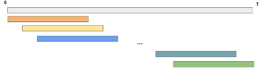
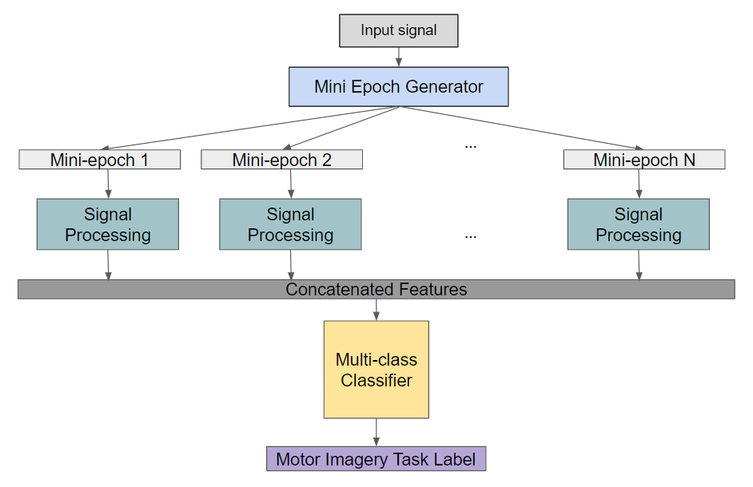
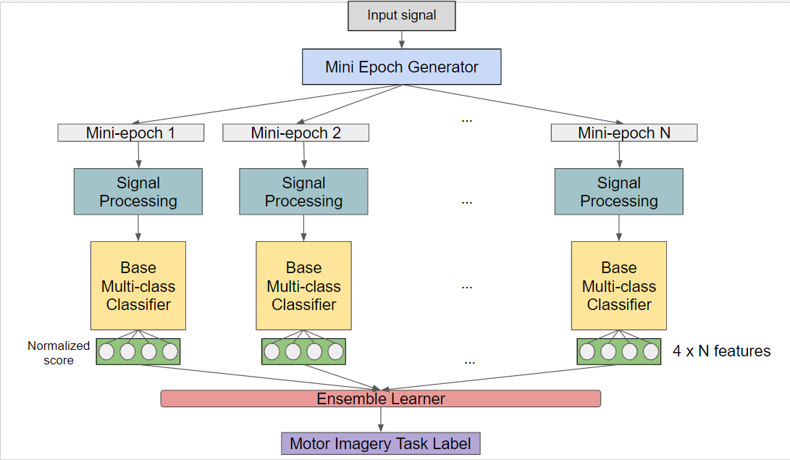
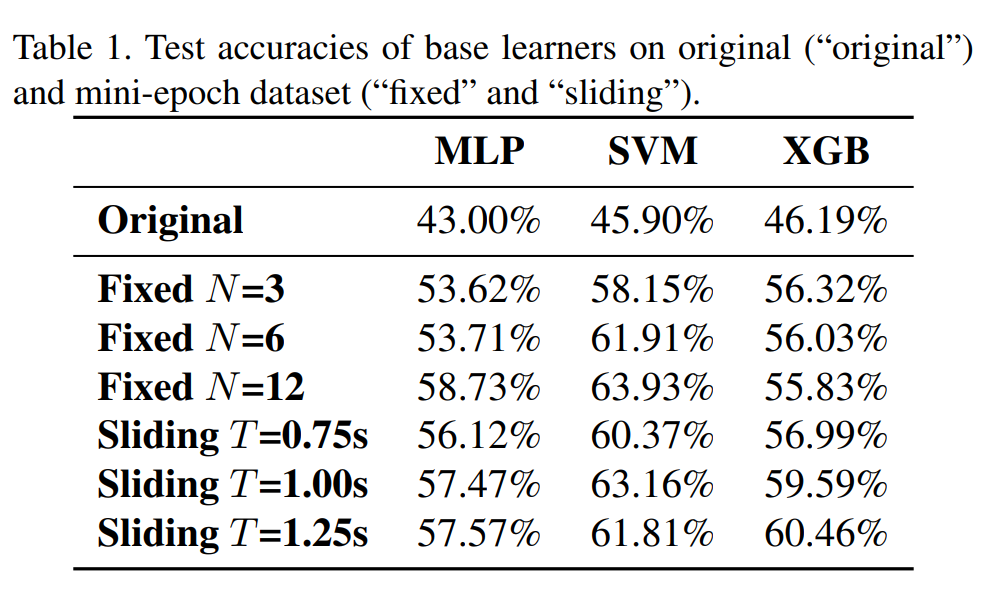
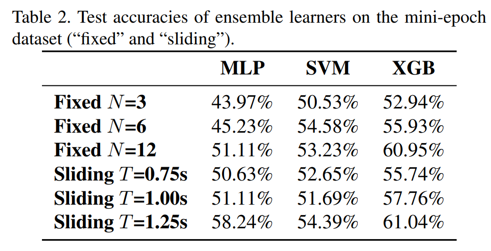

Classification of motor imagery tasks based on EEG signals has a wide range of applications in clinical science and Brain-Computer Interfaces (BCIs). However, most deep learning attempts at motor imagery classification fail to retain the temporal information in the EEG signals that is critical for motor imagery. Here, we propose two algorithms, mini-epoch learning and mini-epoch ensemble learning, that aim to tackle this limitation.

## Data Selection 

Data for this project was taken from the Berlin Brain-Computer Interface (BCI) Competition IV [dataset](https://www.bbci.de/competition/iv/#dataset2a) 2a. In this, we have subjects performing motor imagery tasks. Motor imagery is a cognitive process in where a subject imagines performing a movement without moving their body. In this experimental setup, subjects were asked to imagine four movements: moving the left hand, right hand, tongue, and foot. 

## Feature Selection

We pull relevant information from the EEG signals by
extracting the data 1 second to 4 seconds after the stimulus
was cued. From here, we divide the input signals in the
time domain into small sub-intervals, which we will refer to
as “mini-epochs”. We experimented with two mini-epoch
generation strategies: fixed and sliding.

1. Fixed mini-epoch window: The time signal is divided
into N non-overlapping intervals with equal length. In
this approach, the next interval starts from the point
where the first interval ends as shown below. Each
mini-epoch spans T = 3 N seconds

2. Sliding mini-epoch window: With fixed window
length T second of each epoch and the number of mini-
epochs N determined, the mini-epoch can be gener-
ated by sliding the window by increment of ∆t = (3−T)/(N−1)
seconds. Using this approach, we can more flexibly
determine the mini-epoch duration and the number of
mini-epochs while spanning the full time sequence via
varying the parameters T and N . These mini-epochs
can be overlapping as shown in Figure 3. Using this
approach, we can more clearly observe the effect of trimming the EEG signal into sub-intervals and look
for an optimal mini-epoch length that extracts the significance of different time steps for the EEG signal.

## Preprocessing

In our approach, after adding our mini-epoch window implementation, we follow the below pipeline.

1. Filter the signal through a bandpass filter from 7Hz to
30Hz, which is the only frequency range containing
relevant information about the motor imagery tasks.

2. Remove signals from EOG channels and consider only
the 22 EEG channels for motor imagery tasks.

3. Apply wavelet packet decomposition (WPD) tech-
nique to the resulting signal to extract features in the
frequency domain. WPD is an extension of Wavelet
Decomposition that comprises several bases with more
filtering operations applied to the wavelets.

4. Apply Common Spatial Pattern (CSP) technique for
extracting spatial features from the signal. It has been
widely used for feature extraction in EEG-based BCI
systems for motor imagery. 

## Learning Architectures

We explore two learning architectures: mini-epoch learning and mini-epoch ensemble learning.

1. **Mini-epoch learning**: After signal processing is applied to our data, we create
a feature set out of the resulting signals. From here, this
feature set is fed into a classifier to output the most probable class out of the entire time series. This classifier can be any classification algorithm, such as multi-layer perception (MLP), XGBoost, and support vector machine (SVM).

2. **Mini-epoch ensemble learning**: In this implementation, after signal processing is applied
to our data, we feed the resulting signals to a selected base
multi-class classifier. However, instead of directly yielding
the predicted label, these base classifiers are employed to
generate the normalized scores for each label. These nor-
malized scores indicate the probability distribution of each
label predicted within each mini-epoch. Like the classifier
in the mini-epoch learning algorithm, the base classifiers
can be implemented with any classification algorithm. These N base classifiers form the ensemble to make the
final prediction for the last step. 

## Training and Testing

We look to test our feature selection technique using three classifiers: multi-layer perceptron (MLP), XGBoost, and SVM. We find that implementing our mini-epoch learning algorithm with SVM proved to be the most accurate in identifying different motor imagery tasks, with an accuracy of 63.16%. 

Implementing mini-epoch ensemble learning with XGB recorded the highest accuracy of 61.04%.

## Acknowledgements

This group project was inspired by ECE 271B: Statistical Learning II, taught at UC San Diego under Dr. Manuela Vasconcelos.
